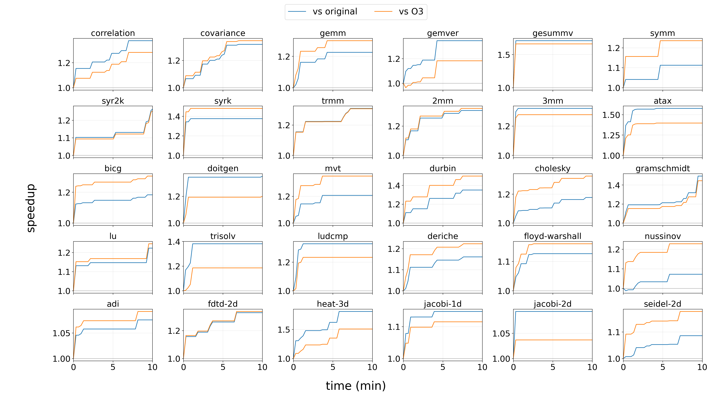

<p align="center">
  
</p>

# RuyiTuner

[English](README.md) | [简体中文](README.zh-CN.md)

RuyiTuner 是为了对具体程序做编译优化调优。现代 LLVM 的 pass 空间很大，而 `-O3`、`-Oz` 这类固定优化流水线本质上是一刀切策略：它们是很强的通用 baseline，但不可能对每一个程序、每一种 workload、每一个运行时间目标都最优。

不同程序的最优 pass 序列往往不同，两个 pass 之间的组合效应也可能随着输入程序变化而变成正向、无效或负向。RuyiTuner 的目标就是构建可运行的 LLVM IR 数据集，测量真实运行时间下的 pass 协同性，构建协同大图，并利用这张图为每个目标程序搜索更优秀的优化序列。

RuyiTuner 目前只支持 LLVM New Pass Manager pipeline。

## 使用流程

### 1. 用自己的 LLVM 工具链构建 LLVM IR

RuyiTuner 不自带编译器。先用本地 LLVM 工具链配置 CMake：

```bash
cmake -S . -B build \
  -DRUYI_CLANG=/path/to/clang \
  -DRUYI_CLANGXX=/path/to/clang++ \
  -DRUYI_OPT=/path/to/opt \
  -DRUYI_LLVM_LINK=/path/to/llvm-link
cmake --build build --target ruyi-datasets
```

CMake 会初始化 submodule，准备示例 train/test 源码，构建可运行的 `.ll` 文件，并生成合法的 LLVM New Pass Manager action 元数据。

主要输出包括：

- `dataset/train`：验证通过的训练集 LLVM IR。
- `dataset/test_ll`：测试集 LLVM IR，每个可执行程序对应一个 linked `.ll`。
- `manifests/training_ll_manifest.csv`：训练样本索引。
- `manifests/test_ll_manifest.csv`：测试样本索引，包括运行信息。
- `manifests/llvm22_opt_pass_actions.csv`：从用户的 `opt --print-passes` 提取，并在一个训练 `.ll` 上验证过的 LLVM New Pass Manager pass 元数据。

也可以只构建其中一部分：

```bash
cmake --build build --target train-ll
cmake --build build --target test-ll
cmake --build build --target extract-passes
```

`extract-passes` 依赖 `train-ll`，因为它会在 `dataset/train/yarpgen_seed_1_-O2.ll` 上验证候选 NPM pass。生成的 CSV 和 LLVM 工具链版本相关；如果切换 LLVM 版本，需要重新生成。

默认训练集只是一个示例。用户可以换成任何能编译成 LLVM IR、能从 `.ll` 重新编译并成功运行的 C/C++ 程序。默认训练集不包含 SPEC CPU、PolyBench 和 cBench；PolyBench 和 cBench 作为测试集保留。

### 2. 直接使用预计算协同图调优

CMake 完成后可以直接开始调优。第一次使用不需要重新找协同对，也不需要重新建图，因为仓库的 `results/` 里已经包含预计算好的运行时协同数据。

复制示例配置，并改成本地 LLVM 工具链路径：

```bash
cp configs/ruyi.example.toml ruyi.toml
```

调优一个 LLVM IR 文件：

```bash
python3 tools/ruyi.py tune dataset/test_ll/polyBench/linear-algebra_blas_gemm_gemm.ll \
  --config ruyi.toml \
  --time-budget-sec 60 \
  --population-size 16
```

工作流输出默认写到 `runs/<task>-<timestamp>/`，该目录已被 Git 忽略。`tools/` 放面向用户的工作流入口，`scripts/` 放底层数据集、构图和调优构件。

### 3. 可选：在自己的机器上重建协同数据

构建协同对很慢，因为它要反复编译和运行大量 pass 组合。协同对也和机器有关，因为 metric 是端到端运行时间。仓库里的预计算协同数据是在 Intel(R) Xeon(R) Gold 6430 机器上构建的：2 路 CPU，每路 32 核，每核 2 线程，共 128 个逻辑 CPU；LLVM 工具链版本为 LLVM 22.0.0git。

预计算协同图在其他机器上可能仍然有一定泛化性，所以可以先直接用。为了获得更贴近本机的结果，建议最终在目标机器上重新构建协同对和图：

```bash
python3 tools/ruyi.py find-synergy --config ruyi.toml --run-dir runs/local-synergy
python3 tools/ruyi.py build-graph --config ruyi.toml \
  --summary runs/local-synergy/runtime_synergy.csv \
  --run-dir runs/local-graph
```

之后用本机重建的图调优：

```bash
python3 tools/ruyi.py tune path/to/test.ll \
  --config ruyi.toml \
  --edge-csv runs/local-graph/runtime_synergy_graph.edges.csv
```

## 预计算文件

仓库包含：

- `results/runtime_synergy_full_all/*.runtime_synergy.csv`：每个训练 benchmark 的协同对 CSV。
- `results/runtime_synergy_full_all.csv`：已完成 benchmark 的 summary。
- `results/runtime_synergy_full_all_pair_stats.csv`：协同对频率和平均效应统计。
- `results/runtime_synergy_graph_100.edges.csv`：加权有向协同图边。
- `results/runtime_synergy_graph_100.nodes.csv`
- `results/runtime_synergy_graph_100.adjacency.json`
- `results/runtime_synergy_graph_100.graphml`

## 示例结果

下图是在同一台 Intel(R) Xeon(R) Gold 6430 机器上调优 PolyBench 的结果。每个 PolyBench 程序调优 10 分钟，使用协同图引导的 GA 搜索；种群数量为 64，最大 pass 序列长度为 32，变异率为 0.9，候选序列编译使用 16 个 worker；每次运行时间测量至少包含 3 次 warmup，并累计至少 300 ms 的测量时间。曲线纵轴是真正的 speedup ratio：`T_original / T_opt` 和 `T_O3 / T_opt`。



大于 1.0 表示调优后的序列更快。
